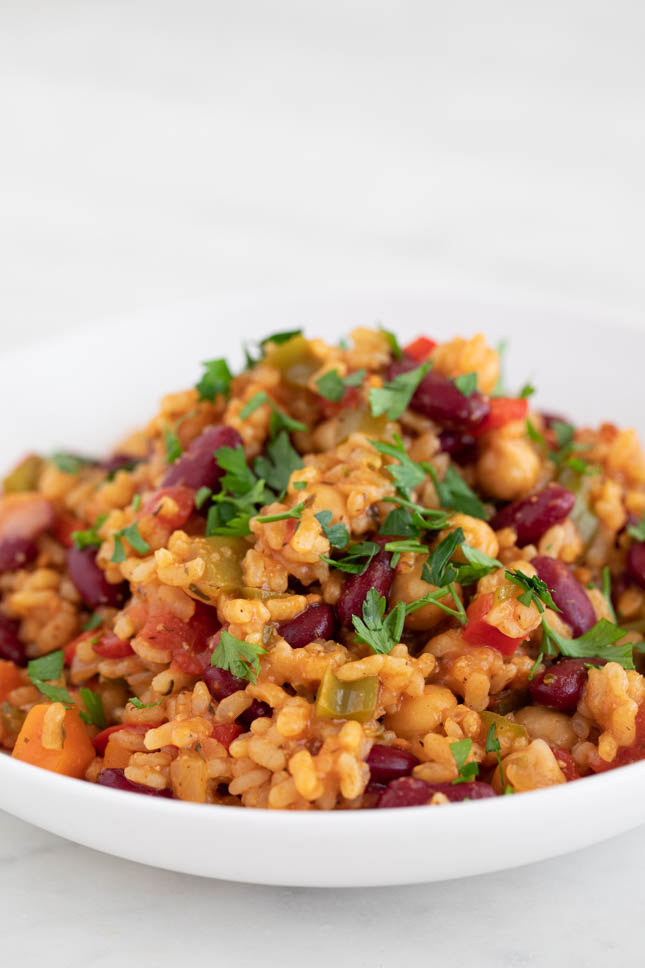

[HOME](README.md) | [BREAKFAST](/breakfast.md) | [LUNCH](/lunch.md) | [DINNER](/dinner.md) | [SNACKS](/snacks.md)

## Dinner

Consider this *[vegan jambalaya](https://simpleveganblog.com/simple-vegan-jambalaya/)* from Simple Vegan Blog



## Ingredients
```
* 1–2 tbsp extra virgin olive oil
* 1/2 onion, chopped
* 2 cloves of garlic, minced
* 1/2 red bell pepper, chopped
* 1/2 green bell pepper, chopped
* 1 carrot, peeled and chopped
* 1 14-ounce can crushed tomatoes (400 g)
* 2 tbsp tamari or soy sauce
* 2 tsp dried oregano
* 1 tsp dried thyme
* 1 tsp garlic powder
* 1 tsp onion powder
* 1 tsp cumin powder
* 1 tsp paprika
* 1/8 tsp ground black pepper
* 1/8 tsp cayenne powder
* 1 cup uncooked rice (200 g), I used short grain white rice
* 3 cups water or vegetable stock (750 ml)
* 1 cup canned or cooked chickpeas (180 g)
* 1 cup canned or cooked kidney beans (180 g)
* Chopped fresh parsley for garnish (optional)
```
## Instructions

1. Add the oil to a skillet or large pot and when it’s hot add the veggies and cook over medium-high heat for 5 minutes.
1. Add the crushed tomatoes and cook another 5 minutes.
1. Add the tamari or soy sauce and the spices and stir. Then add the rice and the water or vegetable stock and bring to a boil. Cook over medium-high heat for 15 minutes or until the rice is cooked.
1. Add the chickpeas and beans, stir and cook 1 to 2 minutes more.
1. Serve with some chopped fresh parsley on top (optional).
1. Keep leftovers in the fridge in a sealed container for 5-7 days.

----------
Next we'll move to **[snacks](/snacks.md)** that you can eat throughout the day